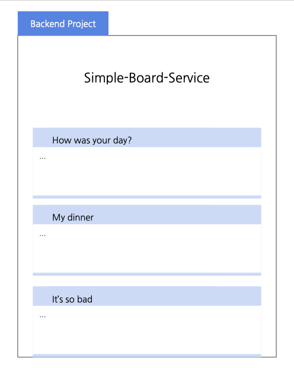
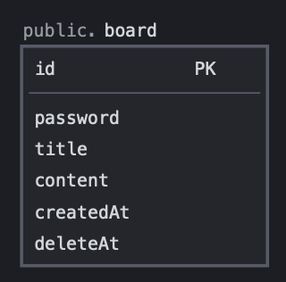

# Simple Board Service

<a href="https://www.npmjs.com/~nestjscore" target="_blank"></a>
<a href="https://www.npmjs.com/~nestjscore" target="_blank"></a>

(기타 기술 스택)



</br >

게시글 등록 및 조회를 하는 백엔드 API 서버입니다.

간단히 비밀번호를 설정하여 글을 등록할 수 있습니다.

위 그림과 같은 화면을 구상하며 개발하였습니다.

</br >
</br >

## 목차

---

[분석 및 설계](#분석-및-설계)

[테스트 방법](#테스트-방법)

[API 명세](#api-명세)

</br >
</br >

## 분석 및 설계

---

### 1. 게시글



</br >

- 게시글 제목 20자 이내 (+ not null)
- 게시글 내용 200자 이내 (+ not null)

class-validator를 통해 조건을 추가하였으며, 두 항목 모두 없어서는 안되므로 Null이면 안된다는 조건을 따로 덧붙였습니다.

</br >

### 2. 비밀번호

- 6자리 이상 (+ 15자리 미만)
- 암호화
- 숫자 1개 이상 포함

마찬가지로 class-validator를 통해 자리 수를 체크했습니다. 이 때 비밀번호가 무한히 길어지는 것도 말이 되지 않으므로, 15자 미만이라는 조건을 따로 덧붙였습니다.

암호화는 bcrypt 패키지를 통해 구현했다. 정규식을 통해 숫자 포함 여부를 체크합니다.

</br >
</br >

## 테스트 방법

---

</br >

로컬 MySQL 설치

[MySQL Community Server Downloads](https://dev.mysql.com/downloads/mysql/)

</br >

.env 파일 설정

```
USERNAME=root
PASSWORD={your_password}
DATABASE=simple_board
HOST=localhost
```

</br >

실행

```shell
yarn
npm run start
```

</br >

swagger를 통한 테스트 : https://docs.nestjs.com/support

</br >
</br >

## API 명세

---

### 1. [POST] 게시글 생성

사용자로부터 게시글 비밀번호를 비롯하여 제목, 내용을 입력받고 게시글을 생성합니다.

! 제약 조건

제목 : 20자리 이내

내용 : 200자리 이내

비밀번호 :

- 6자리 이상 15자리 미만
- 영소문자와 숫자, 숫자 1개 이상

</br >

Request URL : http://localhost:3000/api/board

Request Body 예시

```json
{
  "password": "abcde1",
  "title": "❤ title",
  "content": "come contents 😽"
}
```

</br >

결과

```json
{
  "statusCode": 201,
  "message": "게시글이 등록되었습니다."
}
```

</br >

에러 케이스 1. 제목 글자 수 초과

```json
{
  "statusCode": 400,
  "message": ["title must be shorter than or equal to 20 characters"],
  "error": "Bad Request"
}
```

</br >

에러 케이스 2. 내용 글자 수 초과

```json
{
  "statusCode": 400,
  "message": ["content must be shorter than or equal to 200 characters"],
  "error": "Bad Request"
}
```

에러 케이스 3. 비밀번호 글자 수

```json
{
  "statusCode": 400,
  "message": ["password must be longer than or equal to 6 characters"],
  "error": "Bad Request"
}
```

에러 케이스 4. 비밀번호 숫자 미포함

```json
{
  "statusCode": 400,
  "message": "비밀번호에는 최소 1자 이상의 숫자가 포함되어야 합니다."
}
```

</br >
</br >

### 2. [GET] 게시글 조회

게시글을 최신 순으로 20개씩 조회합니다. 제목, 내용, 작성 시간을 불러보입니다.

사용자가 입력한 offset 값 이상의 게시글을 조회하는데, 예를들어 다음과 같습니다.

```
offset 0 : 최신 순 1번째 ~ 20번째 게시글 조회

offset 20 : 최신 순 21번째 ~ 40번째 게시글 조회
```

</br >

Request URL : http://localhost:3000/api/board/{offset}

</br >

결과

```json
{
  "data": [
    {
      "title": "❤ title20",
      "content": "come contents 😽",
      "createdAt": "2022-09-07T00:51:44.567Z"
    },
    {
      "title": "❤ title19",
      "content": "come contents 😽",
      "createdAt": "2022-09-07T00:51:41.154Z"
    },
    ...
  ],
  "statusCode": 200,
  "message": "게시글을 불러옵니다."
}
```

</br >

에러 케이스 1.

```json
{
  "statusCode": 404,
  "message": "게시글이 존재하지 않습니다."
}
```

</br >
</br >

### 3. [DELETE] 게시글 삭제

사용자로부터 게시글 아이디와 비밀번호를 받고 해당 게시글을 삭제합니다.

</br >

Request URL : http://localhost:3000/api/board

Request Body 예시

```json
{
  "id": "0161e1a9-7a2e-40e7-8dec-0084616f43c5",
  "password": "abcde1"
}
```

</br >

결과

```json
{
  "statuscode": 200,
  "message": "게시글을 삭제하였습니다."
}
```

</br >

에러 케이스 1.

```json
{
  "statsCode": 404,
  "message": "삭제하고자 하는 게시글이 이미 존재하지 않습니다."
}
```

</br >

에러 케이스 2.

```json
{
  "statusCode": 403,
  "message": "게시글의 비밀번호와 일치하지 않습니다."
}
```

</br >
</br >

Nest is an MIT-licensed open source project. It can grow thanks to the sponsors and support by the amazing backers. If you'd like to join them, please [read more here](https://docs.nestjs.com/support).
