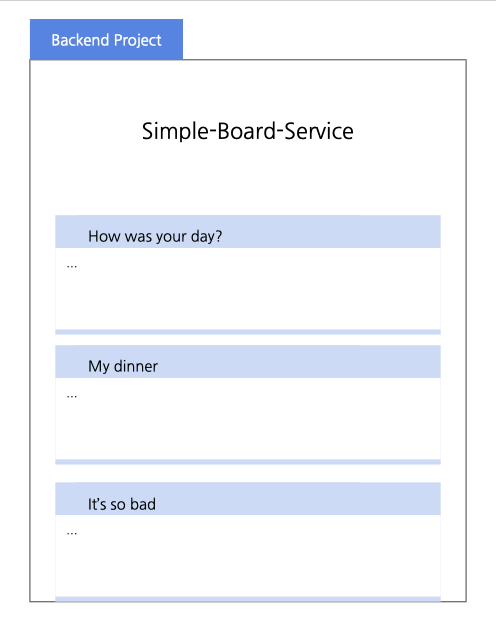

# Simple Board Service

(기타 기술 스택)

게시글 등록 및 조회를 하는 백엔드 API 서버입니다.
간단히 비밀번호를 설정하여 글을 등록할 수 있습니다.
위 그림과 같은 화면을 구상하였습니다.

 
 

## 목차

---

[분석 및 설계](#분석-및-설계)

[테스트 방법](#테스트-방법)

[API 명세](#api-명세)

[구현 과정](#구현-과정)

[주요 이슈](#주요-이슈)

 
 

## 분석 및 설계

---

작성 예정

 
 

## 테스트 방법

---

작성 예정

 
 

## API 명세

---

작성 예정

 
 

## 구현 과정

---

작성 예정

 
 

## 주요 이슈

---

작성 예정

 
 

Nest is an MIT-licensed open source project. It can grow thanks to the sponsors and support by the amazing backers. If you'd like to join them, please [read more here](https://docs.nestjs.com/support).
